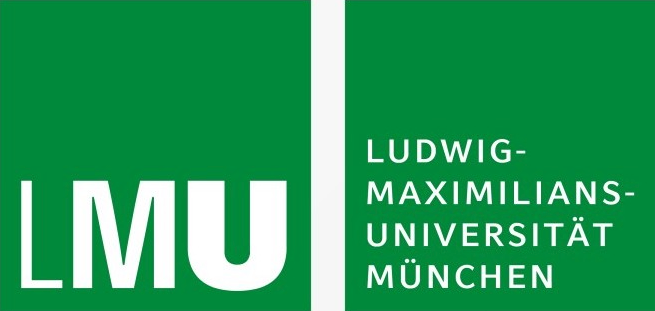

```{r setup, include=FALSE}
options(htmltools.dir.version = FALSE)
knitr::opts_chunk$set(continue = TRUE, tidy = FALSE, warning = FALSE, 
                      message = FALSE,fig.width = 6, 
                      fig.asp = 0.618, fig.retina = 3, fig.align = 'center',
                      out.width = "70%")
knitr::opts_knit$set(global.par = TRUE)

library(tidyverse)
```


layout: true

background-image: url(figures/TUM_Logo.png)
background-position: 96.7% 4.3%
background-size: 7%


---

background-image: url("figures/i_love_math_mardi.png")
background-position: center
background-size: 100%


---


### .tg[Ma]thematical .tg[R]esearch .tg[D]ata .tg[I]nitiative

.pull-left-40[.tb[MaRDI’s Mission:] 
.small[
1. develop a robust __Mathematical Research Data Infrastructure__, being useful within mathematics and other disciplines as well as non-scientific fields

2. set __standards__ and __confirmable workflows__ for certified Mathematical Research Data 

3. provide __services__ to both the mathematical and wider scientific community
]

]

.pull-right-60[

<br><br><br>
```{r, echo=FALSE, fig.align='right', out.width="100%"}
knitr::include_graphics("figures/MaRDI_Mission.png")
```
.right[.small[
.grey[@ MaRDI4nfdi]


]]]

.tb[MaRDI’s Vision:] Building a community that embraces a .tg[FAIR data] culture and research workflow through the sustainable realization of MaRDI findings.


---

background-image: url("figures/MaRDI_Overview.png")
background-position: center
background-size: 100%
class: mardi, bottom


.right[.small[@ MaRDI4nfdi]]

---

### TA3 `r emo::ji("heart")` Math and Fair Data


<br>

.pull-left[

```{r, echo=FALSE, out.width="44%",  fig.align='left'}
knitr::include_graphics("figures/TUM_Logo.png")
```

<br>

__Prof. Mathias Drton__    
.small[Chair of Mathematical Statistics    
MaRDI Co-Spokesperson     
Core Member of MDSI    
ELLIS Munich Faculty]

__Dr. Stephan Haug__    
.small[
TUM|Stat Consulting Center
]
...


]

.pull-right[

```{r, echo=FALSE, fig.align='left', out.width="50%" }

```

<br>

__Prof. Bernd Bischl__    
.small[
Chair of Statistical Learning & Data Science    
MaRDI Co-Spokesperson     
Co-Director of MCML    
ELLIS Munich Faculty]

__Dr. Giuseppe Casalicchio__    
.small[
OpenML Core Team]

...
]


---

### Work program of TA3

.tg[M3.1: Library of Curated Benchmark Datasets]    
.small[__Aim:__ provide _task-specific_ libraries of curated benchmark datasets following FAIR principles ]


.tg[M3.2: Library of Statistical Analyses]    
.small[__Aim:__ provide exhaustive statistical analysis of the datasets from M3.1, which will be demos that connect the data to statistical methods] 

.tg[M3.3: Empirical Analysis of Machine Learning Experiments]    
.small[__Aim:__ provide (tools to analyze) results of benchmark experiments of the datasets from M3.1; summarize common pitfalls and list guideline to avoid those pitfalls]

.tg[M3.4: Standards for Peer Review of Numerical Experimentation]     
.small[__Aim:__ establish standards for peer-review of numerical experiments as well as the software code with which the experiments are conducted]


.content-box-blue[
M3.1 to M3.3 use, adapt OpenML, create a connection to the MaRDI portal and make all results extendable by the community
]
